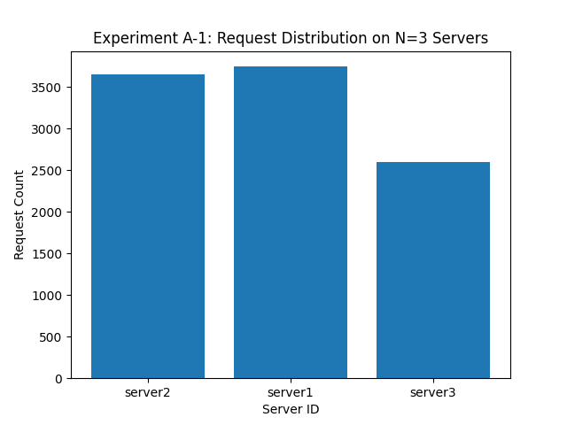
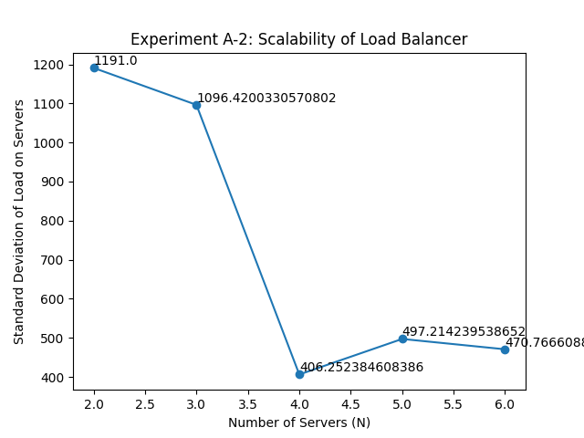

# Assignment 1

## Initial Setup

- Install Docker using the [script](./docker_install.sh)

## Task - 1: Server

- Change working directory to `Assignment-1/Task-1`
- Build the docker image using the command `docker build -t task1-image .`
- Run the docker container using the command `docker run -it -p <port>:5000 -e SERVER_ID=<server-id> task1-image`
- The server is now running on the specified port

## Task - 2: Consistent Hashing

- Implemented Consistent Hashing class using an array, with linear/quadratic probing and default arguments as
    - Number of Server Containers managed by the load balancer (N) = 3
    - Total number of slots in the consistent hash map (#slots) = 512
    - Number of virtual servers for each server container (K) = $log$(512) = 9
    - Hash function for request mapping H($i$) = $i^2 + 2i + 17$
    - Hash function for virtual server mapping $Φ$($i$, $j$) = $i^2 + j^2 + 2j + 25$

## Task - 3: Load Balancer

- Run `make build` from `Assignment-1` to build the server and load balancer images.
- Run `make up` to run 3 server containers and a load balancer container.
- Load Balancer is running on port `5000`.
- Load Balancer API endpoints are
    - `/rep, method=GET`
        - returns the current replica list
    - `/add, method=POST`
        - JSON payload: `{"n": <nservers>, "hostnames": [<hostnames>]}`
        - Spawns `n` servers with the given hostnames.
        - If required number of hostnames are not provided, then the remaining servers are spawned with random hostnames.
        - If the list of hostnames has server name same as any of the existing servers, then the server is not spawned. In this case if none of the servers are spawned, then the error reponse is returned.
    - `/rm, method=DELETE`
        - JSON payload: `{"n": <nservers>, "hostnames": [<hostnames>]}`
        - Removes `n` servers with the given hostnames.
        - If required number of hostnames are not provided, then required number of servers are selected randomly and removed.
        - If the list contains any server name which is not present in the current replica list, then the error response is returned.
    - `/<path>, method=GET`
        - Forwards the request to the appropriate server using consistent hashing.
        - If the endpoint `/<path>` is not registered with any server, then the error response is returned.

## Task - 4: Analysis
### A-1:
Launching 10,000 async requests on 3 servers produced the bar graph given below. From the bar graph, we can see that while the number of requests per server is not exactly equal, on an average, each server is handling around same number of requests. This is because of the consistent hashing algorithm used in the load balancer. The hash function can further be improved to get better load balancing.

### A-2:
Launching 10,000 async requests on variying servers count(from 2 to 6) yielded the line graph given below.
From the below graph, we can see that as the number of servers increases, the average number of requests per server decreases.
\
More interestingly, the standard deviation of the number of requests per server also decreases as the number of servers increases from 2 to 6. This is because of the fact that as the number of servers increases, the number of requests per server becomes more uniform. This tells us that the load balancing is better as the number of servers increases. This is mainly due to to almost uniform distribution of the requests among the servers. The standard deviation of the number of requests per server is given below. 

### A-3:
All endpoints of the load balancer were tested successfully, and the load balancer distributed incoming requests among the available server instances. It can be verified by running the [analysis.py](./Task-4/analysis.py). When a running server is stopped, the loadbalancer detects it during heartbeat check. When loadbalancer sents a request to `\heartbeat` and if it receives a `ClientConnectionError`, it is assumed that the server is down. Load balancer respawned a new server container and the new server was able to handle the incoming requests just like the old one. The load distribution was even. The distribution can be seen from the bar graph given below.

### A-4:
Modified hash functions as follows:
    - Hash function for request mapping H($i$) = $11i^2 + 17i + 23$
    - Hash function for virtual server mapping $Φ$($i$, $j$) = $23i^2 + 71j^2 + 59j + 301$

Results obtained for A1 using this modified hash function:

Results obtained for A2 using this modified hash function:
\

