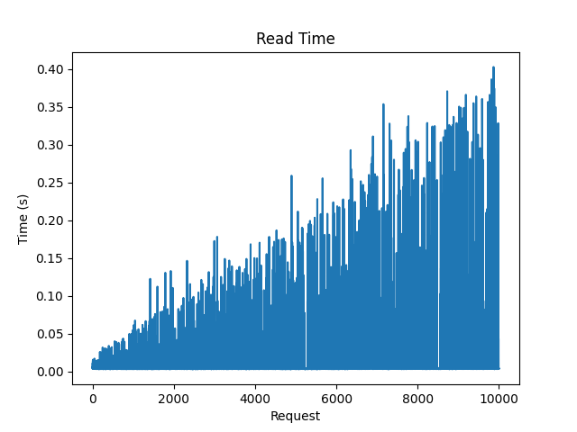
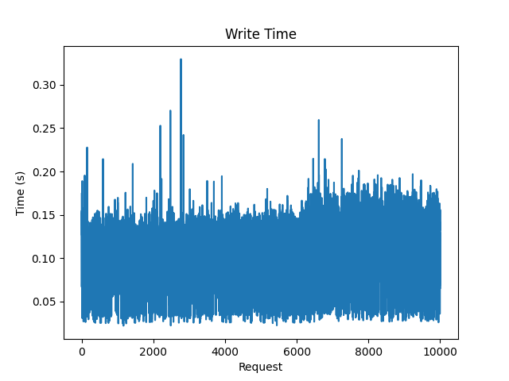
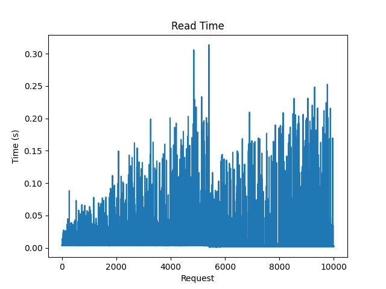
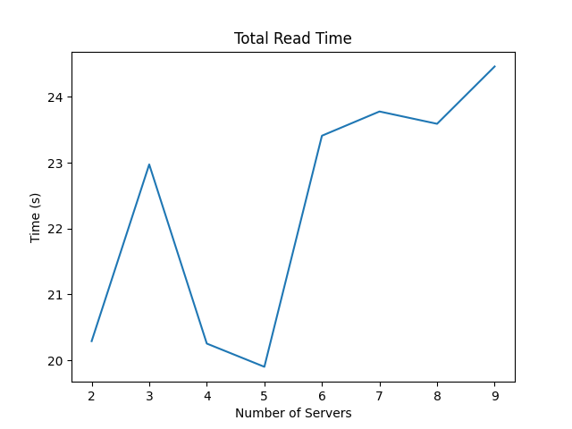
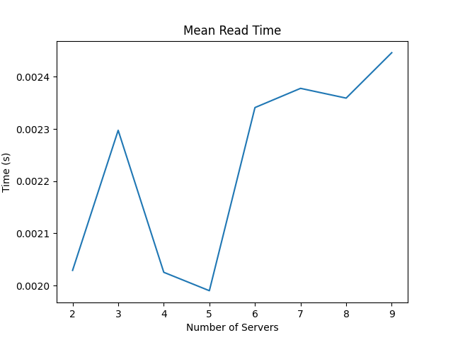

# Assignment 2

## Initial Setup

- Install Docker using the [script](../Assignment-1/docker_install.sh)

## Task-1: Server

- Change working directory to `Assignment-2/Task-1`
- Build the docker image using the command `docker build -t server-image .`
- Run the docker container using the command `docker run -it -p <port>:5000 -e SERVER_NAME=<server-name> server-image`
- The server is now running on the specified port

## Task-2: Load Balancer
- Run `make build` from `Assignment-2` to build the server and load balancer images.
- Run `make up` to run a load balancer container.
- Load Balancer is running on port `5000`.
- Load Balancer API endpoints are

    - `/init, method=POST`
        - This endpoint initializes the distributed database across different shards and replicas
          in the server containers
    - `/status, method=GET`
        - This endpoint sends the database configurations upon request
    - `/add, method=POST`
        - This endpoint adds new server instances in the load balancer to scale up with
          increasing client numbers in the system.
    - `/rm, method=DELETE`
        - This endpoint removes server instances from the load balancer to scale down with
          decreasing client numbers in the system.
    - `/read, method=GET`
        - Based on the consistent hashing algorithm, this endpoint reads data entries from the
          shard replicas across all server containers. 
    - `/write, method=POST`
        - This endpoint writes data entries in the distributed database.
    - `/update, method=PUT`
        - This endpoint updates data entries in the distributed database.
    - `/del,method=DELETE`
        - This endpoint deletes data entries from the distributed database.

## Task-3: Analysis

### A-1: The read and write speed for 10000 writes and 10000 reads in the default configuration  given in task 2
- Total read time: 147.60585117340088  seconds
- Total write time: 1095.6545538902283  seconds
- Average read time: 0.014760585117340089  seconds
- Average write time: 0.10956545538902283  seconds

    
    
    

    

### A-2: The read and write speed for 10000 writes and 10000 reads when the number of shard replicas is increased (to 7) from the configuration (init endpoint)

10000 writes and read speed up for 10000 reads
- Total read time: 105.23974609375  seconds
- Total write time: 1359.7118179798126  seconds
- Average read time: 0.010523974609375  seconds
- Average write time: 0.13597118179798126  seconds

    
    
    

### Note - Average Read Time decreased in A2 in comparison to A1 whereas Average Write Time increased in A2 in comparison to A1 due to increase in the number of the shard replicas.

### A-3: ncrease the number of Servers (to 10) by adding new servers and increase the number of shards (shard to 6, shard replicas to 8). Define the (init endpoint) configurations according to your choice. Report the write speed up for 10000 writes and read speed up for 10000 reads.

