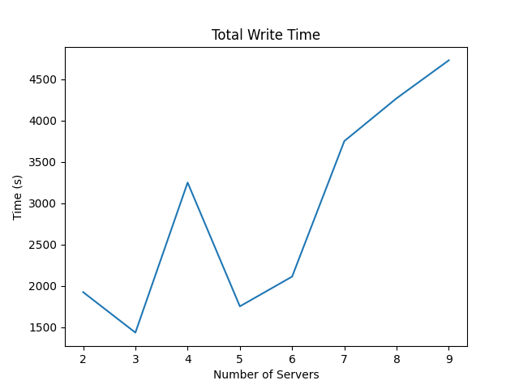
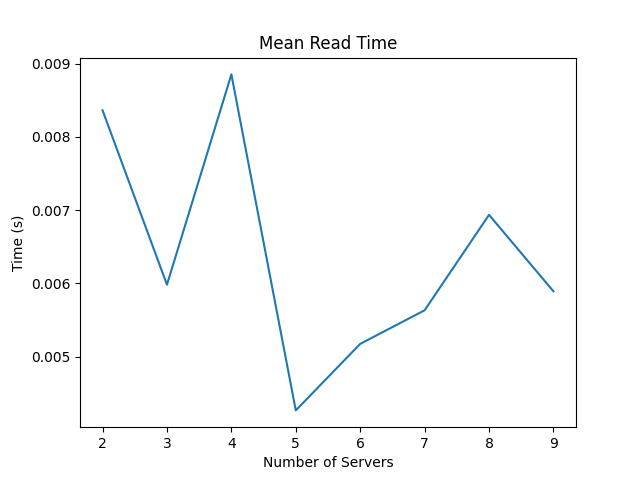

# Assignment 3

## Initial Setup

- Install Docker using the [script](../Assignment-1/docker_install.sh)

## Task-1: Server

- Change working directory to `Assignment-3/Task-1`
- Build the docker image using the command `docker build -t server-image .`
- Run the docker container using the command `docker run -it -p <port>:5000 -e SERVER_NAME=<server-name> server-image`
- The server is now running on the specified port

- Server endpoints that have been modified are
    - `/write, method=POST`
        -  For secondary servers, this endpoint makes changes in the log and then writes data
        entries in a shard in a particular server container.
        - For Primary server it first makes changes to its log, then send
        write request to other servers where same shard is present.
        - Once it gets confirmation from other secondary servers then
i       it writes the data in its database.
     
   - `/update, method=PUT`
        -  This endpoint updates a particular data entry in a shard in a particular server
        container. 
        
   - `/del, method=DELETE`
        -   This endpoint deletes a particular data entry (based on Stud id) in a shard in a
        particular server container.  

## Task-2: Load Balancer
- Run `make build` from `Assignment-3` to build the server and load balancer images.
- Run `make up` to run a load balancer container.
- Load Balancer is running on port `5000`.
- Load Balancer API endpoints are

    - `/init, method=POST`
        - This endpoint initializes the distributed database across different shards and replicas
          in the server containers
    - `/status, method=GET`
        - This endpoint sends the database configurations upon request
    - `/add, method=POST`
        - This endpoint adds new server instances in the load balancer to scale up with
          increasing client numbers in the system.
    - `/rm, method=DELETE`
        -  This endpoint removes server instances in the load balancer to scale down with
        decreasing client or system maintenance. 
        - The endpoint expects a JSON payload that mentions the number of instances
        to be removed and their preferred server names in a list. 
        - If Primary server for a shard is removed then also the Shard
        Manager should trigger the Primary selection from available servers for that shard.
    - `/read, method=GET`
        - Based on the consistent hashing algorithm, this endpoint reads data entries from the
          shard replicas across all server containers. 
    - `/write, method=POST`
        - This endpoint writes data entries in the distributed database.
    - `/update, method=PUT`
        - This endpoint updates data entries in the distributed database.
    - `/del,method=DELETE`
        - This endpoint deletes data entries from the distributed database.

### Design Choices
- WAL
    - Write Ahead Log is maintained for each server to keep track of the changes made to the data.
    - Each entry of WAL has sequence number, type of request and data.
    - The primary server on receiving write/update/delete requests, first it writes to its WAL and then sends the corresponding request to other secondary servers along with its WAL.
    - The secondary servers on receiving a request from the primary server compare its WAL with the WAL received from the primary server and removes the checkpointed entries.
    - The secondary server then appends the additional entries of primary's WAL to its own WAL
    - It then executes the newly added entries of its WAL and return seq_no of most recent entry executed.
    - Once the primary server receives confirmation from majority of the secondary servers, it executes the request on the database. It also updates its WAL according to seq_no received from secondary and removes the entries from its WAL.

- Primary Server
    - Initially the primary server for a shard is selected randomly from the available servers for that shard.
    - During primary server re-election, the server with the most updated WAL is selected as the primary server.

## Task-3: Analysis

### A-1: The read and write speed for 10000 writes and 10000 reads in the default configuration  given in task 2
- Total read time: 74.11880731582642  seconds
- Total write time: 753.9955163002014  seconds
- Average read time: 0.007411880731582642  seconds
- Average write time: 0.07539955163002014  seconds

    
    
    

    

### A-2: The read and write speed for 10000 writes and 10000 reads when the number of shard replicas is increased (to 7) from the configuration (init endpoint)

10000 writes and read speed up for 10000 reads
- Total read time: 80.23558616638184  seconds
- Total write time: 2315.9703540802  seconds
- Average read time: 0.008023558616638183  seconds
- Average write time: 0.23159703540802  seconds

    
    
    

### Note - Average Read Time decreased in A2 in comparison to A1 whereas Average Write Time increased in A2 in comparison to A1 due to increase in the number of the shard replicas.

### A-3: Increase the number of Servers (to 10) by adding new servers and increase the number of shards (shard to 6, shard replicas to 8). Define the (init endpoint) configurations according to your choice. Report the write speed up for 10000 writes and read speed up for 10000 reads.

